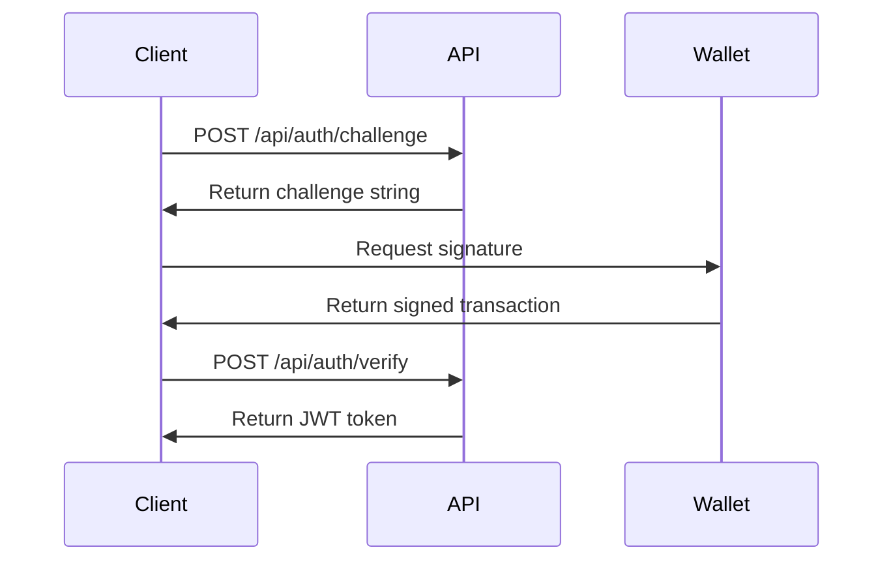

# DOB Validator API Documentation

## Overview

The DOB Validator API provides a comprehensive set of endpoints for device validation, user authentication, profile management, and smart contract integration. Built on Node.js with Express and PostgreSQL, it serves both the frontend user interface and backoffice admin panel.

## Base URL

- **Development**: `http://localhost:3001`
- **Staging**: `https://staging-api.dobprotocol.com`
- **Production**: `https://api.dobprotocol.com`

## Authentication

### Wallet-Based Authentication

The API uses Stellar wallet-based authentication with a challenge-response mechanism:

1. **Challenge Request**: `POST /api/auth/challenge`
2. **Signature Verification**: `POST /api/auth/verify`
3. **JWT Token**: Issued upon successful verification

### Authentication Flow



## API Endpoints

### Authentication Endpoints

#### POST /api/auth/challenge

Request a challenge for wallet signature verification.

**Request Body:**

```json
{
  "walletAddress": "GABC123456789012345678901234567890123456789012345678901234567890"
}
```

**Response:**

```json
{
  "success": true,
  "challenge": "DOB_VALIDATOR_AUTH_1234567890_abc123",
  "message": "Please sign this challenge with your wallet to authenticate"
}
```

#### POST /api/auth/verify

Verify wallet signature and issue JWT token.

**Request Body:**

```json
{
  "walletAddress": "GABC123456789012345678901234567890123456789012345678901234567890",
  "signature": "base64_signature_here",
  "challenge": "DOB_VALIDATOR_AUTH_1234567890_abc123"
}
```

**Response:**

```json
{
  "success": true,
  "token": "eyJhbGciOiJIUzI1NiIsInR5cCI6IkpXVCJ9...",
  "expiresIn": "7d",
  "message": "Authentication successful"
}
```

### Profile Management

#### GET /api/profile

Get user profile (requires authentication).

**Headers:**

```
Authorization: Bearer <jwt_token>
```

**Response:**

```json
{
  "success": true,
  "data": {
    "id": "user_id",
    "walletAddress": "GABC123...",
    "name": "John Doe",
    "email": "john@example.com",
    "company": "Example Corp",
    "role": "OPERATOR",
    "createdAt": "2024-01-15T10:30:00Z"
  }
}
```

#### POST /api/profile

Create or update user profile (requires authentication).

**Headers:**

```
Authorization: Bearer <jwt_token>
```

**Request Body:**

```json
{
  "name": "John Doe",
  "email": "john@example.com",
  "company": "Example Corp",
  "phone": "+1234567890"
}
```

### Submissions

#### POST /api/submissions

Submit a new device validation request (requires authentication).

**Headers:**

```
Authorization: Bearer <jwt_token>
```

**Request Body:**

```json
{
  "deviceName": "Solar Farm Alpha",
  "deviceType": "SOLAR_PANEL",
  "serialNumber": "SF-2024-001",
  "manufacturer": "SolarTech Inc",
  "location": "California, USA",
  "capacity": "1000 kW",
  "financialData": {
    "initialInvestment": 500000,
    "annualRevenue": 75000,
    "operatingCosts": 15000
  },
  "technicalSpecs": {
    "efficiency": 0.85,
    "lifespan": 25,
    "warranty": 10
  }
}
```

#### GET /api/submissions

Get user's submissions (requires authentication).

**Headers:**

```
Authorization: Bearer <jwt_token>
```

**Query Parameters:**

- `status`: Filter by status (DRAFT, SUBMITTED, UNDER_REVIEW, APPROVED, REJECTED)
- `page`: Page number (default: 1)
- `limit`: Items per page (default: 10)

### Admin Endpoints

#### GET /api/admin/submissions

Get all submissions (admin only).

**Headers:**

```
Authorization: Bearer <admin_jwt_token>
```

#### POST /api/admin/submissions/:id/review

Review a submission (admin only).

**Headers:**

```
Authorization: Bearer <admin_jwt_token>
```

**Request Body:**

```json
{
  "status": "APPROVED",
  "trufaScore": {
    "technical": 85,
    "regulatory": 90,
    "financial": 88,
    "overall": 87.7
  },
  "comments": "Excellent submission with strong financial metrics",
  "certificateData": {
    "certificateId": "CERT-2024-001",
    "validUntil": "2025-01-15T10:30:00Z"
  }
}
```

## Error Handling

### Error Response Format

```json
{
  "success": false,
  "error": "Error message",
  "code": "ERROR_CODE",
  "details": {
    "field": "Additional error details"
  }
}
```

### Common Error Codes

- `AUTH_REQUIRED`: Authentication required
- `INVALID_SIGNATURE`: Invalid wallet signature
- `CHALLENGE_EXPIRED`: Authentication challenge expired
- `RATE_LIMIT_EXCEEDED`: Too many requests
- `VALIDATION_ERROR`: Request validation failed
- `NOT_FOUND`: Resource not found
- `FORBIDDEN`: Access denied
- `INTERNAL_ERROR`: Server error

## Rate Limiting

- **Authentication endpoints**: 5 requests per 15 minutes
- **Other endpoints**: 100 requests per 15 minutes
- **File uploads**: 10 requests per 15 minutes

## Security

### Headers

The API includes security headers:

- `Content-Security-Policy`: Content security policy
- `X-Content-Type-Options`: Prevent MIME type sniffing
- `X-Frame-Options`: Prevent clickjacking
- `X-XSS-Protection`: XSS protection
- `Strict-Transport-Security`: HTTPS enforcement

### CORS

Cross-Origin Resource Sharing is configured for:

- Frontend: `http://localhost:3003`
- Backoffice: `http://localhost:3004`
- Production domains as configured

## Testing

### Postman Collection

A complete Postman collection is available at:
[DOB_Validator_API.postman_collection.json](../frontend/DOB_Validator_API.postman_collection.json)

### Test Scripts

Automated test scripts are available in the `backend/scripts/` directory:

- `simple-test.ts`: Basic functionality tests
- `e2e-test.ts`: End-to-end workflow tests
- `integration-test.ts`: Service integration tests
- `test-complete-flow.ts`: Complete data flow tests

## Support

For API support and questions:

- [GitHub Issues](https://github.com/blessedux/DOBVALIDATOR/issues)
- [Documentation](https://wiki.dobprotocol.com)
- [Technical Documentation](../README.md)
